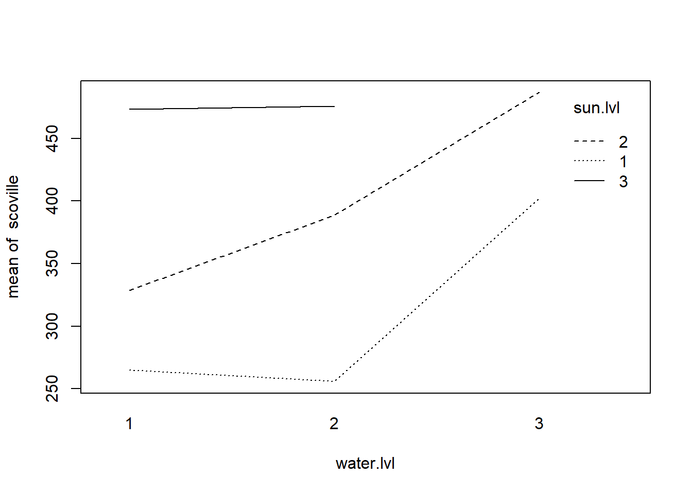
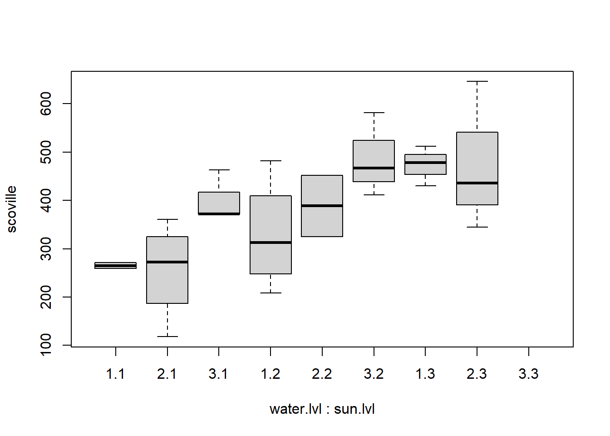
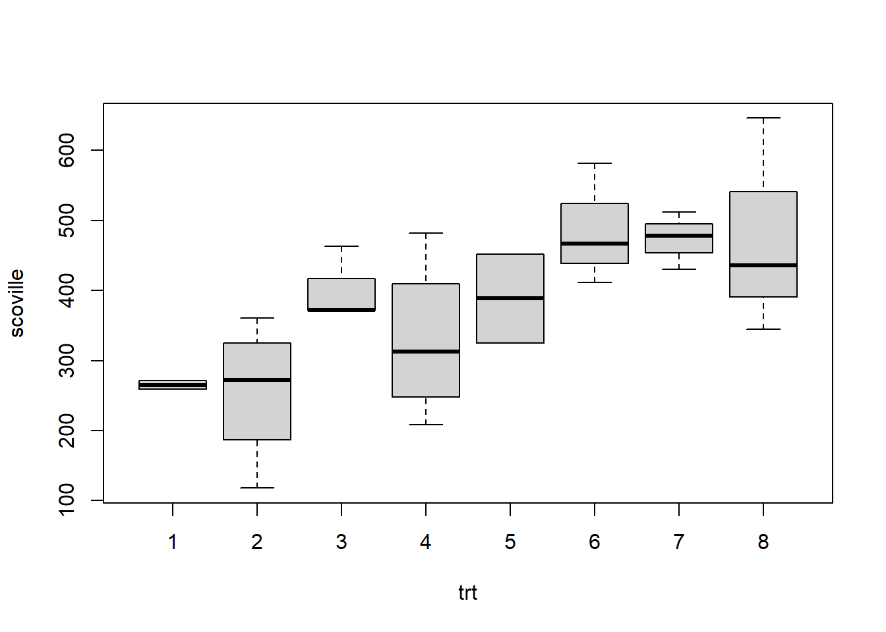

# Missing Cells in Two-Way ANOVA

In this section we consider how to analyze a two-factor experiment when one crossed treatment is unobserved.  If there is no interaction, then this is not problem.  But, when interaction is present the lack of observations in a crossed treatment group makes it challenging to assess those interactions.  There are, essentially, two ways to proceed: 1) use a one-way model, treating the observed crossed treatments as the levels; or, 2) do a partial two-way analysis.  <br><br>

Below, we illustrate these two approaches in the context of a horticulture experiment about jalapenos.

## ANOVA with missing "at random" cell

Scoville (spiciness) measure of jalapeno peppers grown under 3 different watering regimens and 3 different levels of sun exposure.<br><br>

Unbalanced treatment groups with a missing crossed treatment, sun level 3 with water level 3.


```r
my.data
```

```
##    scoville water.lvl sun.lvl
## 1       259         1       1
## 2       271         1       1
## 3       289         2       1
## 4       255         2       1
## 5       361         2       1
## 6       118         2       1
## 7       463         3       1
## 8       372         3       1
## 9       372         3       1
## 10      208         1       2
## 11      288         1       2
## 12      482         1       2
## 13      337         1       2
## 14      452         2       2
## 15      325         2       2
## 16      582         3       2
## 17      411         3       2
## 18      467         3       2
## 19      512         1       3
## 20      430         1       3
## 21      478         1       3
## 22      646         2       3
## 23      436         2       3
## 24      345         2       3
```

```r
kable(aggregate(scoville~water.lvl+sun.lvl+water.lvl*sun.lvl, data = my.data, FUN=mean))
```


|water.lvl |sun.lvl | scoville|
|:---------|:-------|--------:|
|1         |1       | 265.0000|
|2         |1       | 255.7500|
|3         |1       | 402.3333|
|1         |2       | 328.7500|
|2         |2       | 388.5000|
|3         |2       | 486.6667|
|1         |3       | 473.3333|
|2         |3       | 475.6667|

```r
interaction.plot(water.lvl, sun.lvl,  scoville, data = my.data)
```



```r
boxplot(scoville~water.lvl+ sun.lvl, data = my.data)
```




## Do any of the treatments matter?

Can test this two equivalent ways:<br>
  1. fit a one way anova (ignoring that there are two treatment variables) and test if the treatments are different.<br>
  2. fit a linear model and perform the model F test comparing the full model to the intercept only model.<br><br>

The linear model method is slightly more challenging to implement because of the additional constraint imposed by the missing cell.  We have to modify the design matrix from the model.matrix function, or define it by hand.<br><br>


One way anova below.  Notice it says the treatments are not all the same; their mean responses significantly differ for at least one treatment compared to the other 7.  One approach would be to follow this test up with tests of contrasts or pairwise comparisons, corrected using Scheff\'e or Tukey.  Since the data is unbalanced, we should do these by hand.  



```r
my.data.oneway
```

```
##    scoville trt
## 1       259   1
## 2       271   1
## 3       289   2
## 4       255   2
## 5       361   2
## 6       118   2
## 7       463   3
## 8       372   3
## 9       372   3
## 10      208   4
## 11      288   4
## 12      482   4
## 13      337   4
## 14      452   5
## 15      325   5
## 16      582   6
## 17      411   6
## 18      467   6
## 19      512   7
## 20      430   7
## 21      478   7
## 22      646   8
## 23      436   8
## 24      345   8
```

```r
library(car)
Anova(lm(scoville~trt, data = my.data.oneway), type = 'III')
```

```
## Anova Table (Type III tests)
## 
## Response: scoville
##              Sum Sq Df  F value   Pr(>F)    
## (Intercept) 3339450  1 354.1618 2.44e-12 ***
## trt          188009  7   2.8484   0.0393 *  
## Residuals    150867 16                      
## ---
## Signif. codes:  0 '***' 0.001 '**' 0.01 '*' 0.05 '.' 0.1 ' ' 1
```


## Fit a linear model with additional constraints

The other option for testing if any treatments matter is to fit a linear model. However, we cannot estimate all the parameters of the effects model due to missing the combination of sun level 3 and water level 3. We can only estimate 8 parameters: intercept, 2 for sun, 2 for water, and 3 (rather than 4) interactions. The way to deal with this is to find the full model matrix and then omit the last column corresponding to the interaction that is not estimable. IF we just use the lm() function, we'll get an error, but it will still give us some useful output.  Again, we end up having to do some things by hand.


```r
options(contrasts = c('contr.sum', 'contr.sum'))
my.lm<-lm(scoville~water.lvl+sun.lvl+water.lvl*sun.lvl, data = my.data)
summary(my.lm)
```

```
## 
## Call:
## lm(formula = scoville ~ water.lvl + sun.lvl + water.lvl * sun.lvl, 
##     data = my.data)
## 
## Residuals:
##      Min       1Q   Median       3Q      Max 
## -137.750  -41.396   -3.375   44.167  170.333 
## 
## Coefficients: (1 not defined because of singularities)
##                     Estimate Std. Error t value Pr(>|t|)    
## (Intercept)           386.11      41.79   9.240 8.15e-08 ***
## water.lvl1            -30.42      48.55  -0.626    0.540    
## water.lvl2            -12.81      52.02  -0.246    0.809    
## sun.lvl1              -78.42      48.55  -1.615    0.126    
## sun.lvl2               15.19      52.02   0.292    0.774    
## water.lvl1:sun.lvl1   -12.28      49.44  -0.248    0.807    
## water.lvl2:sun.lvl1   -39.14      68.02  -0.575    0.573    
## water.lvl1:sun.lvl2   -42.14      68.02  -0.619    0.544    
## water.lvl2:sun.lvl2       NA         NA      NA       NA    
## ---
## Signif. codes:  0 '***' 0.001 '**' 0.01 '*' 0.05 '.' 0.1 ' ' 1
## 
## Residual standard error: 97.1 on 16 degrees of freedom
## Multiple R-squared:  0.5548,	Adjusted R-squared:   0.36 
## F-statistic: 2.848 on 7 and 16 DF,  p-value: 0.0393
```

```r
my.lm$coefficients
```

```
##         (Intercept)          water.lvl1          water.lvl2            sun.lvl1 
##           386.11111           -30.41667           -12.80556           -78.41667 
##            sun.lvl2 water.lvl1:sun.lvl1 water.lvl2:sun.lvl1 water.lvl1:sun.lvl2 
##            15.19444           -12.27778           -39.13889           -42.13889 
## water.lvl2:sun.lvl2 
##                  NA
```

```r
X <- model.matrix(scoville~water.lvl+sun.lvl+water.lvl*sun.lvl, data = my.data)
X
```

```
##    (Intercept) water.lvl1 water.lvl2 sun.lvl1 sun.lvl2 water.lvl1:sun.lvl1
## 1            1          1          0        1        0                   1
## 2            1          1          0        1        0                   1
## 3            1          0          1        1        0                   0
## 4            1          0          1        1        0                   0
## 5            1          0          1        1        0                   0
## 6            1          0          1        1        0                   0
## 7            1         -1         -1        1        0                  -1
## 8            1         -1         -1        1        0                  -1
## 9            1         -1         -1        1        0                  -1
## 10           1          1          0        0        1                   0
## 11           1          1          0        0        1                   0
## 12           1          1          0        0        1                   0
## 13           1          1          0        0        1                   0
## 14           1          0          1        0        1                   0
## 15           1          0          1        0        1                   0
## 16           1         -1         -1        0        1                   0
## 17           1         -1         -1        0        1                   0
## 18           1         -1         -1        0        1                   0
## 19           1          1          0       -1       -1                  -1
## 20           1          1          0       -1       -1                  -1
## 21           1          1          0       -1       -1                  -1
## 22           1          0          1       -1       -1                   0
## 23           1          0          1       -1       -1                   0
## 24           1          0          1       -1       -1                   0
##    water.lvl2:sun.lvl1 water.lvl1:sun.lvl2 water.lvl2:sun.lvl2
## 1                    0                   0                   0
## 2                    0                   0                   0
## 3                    1                   0                   0
## 4                    1                   0                   0
## 5                    1                   0                   0
## 6                    1                   0                   0
## 7                   -1                   0                   0
## 8                   -1                   0                   0
## 9                   -1                   0                   0
## 10                   0                   1                   0
## 11                   0                   1                   0
## 12                   0                   1                   0
## 13                   0                   1                   0
## 14                   0                   0                   1
## 15                   0                   0                   1
## 16                   0                  -1                  -1
## 17                   0                  -1                  -1
## 18                   0                  -1                  -1
## 19                   0                  -1                   0
## 20                   0                  -1                   0
## 21                   0                  -1                   0
## 22                  -1                   0                  -1
## 23                  -1                   0                  -1
## 24                  -1                   0                  -1
## attr(,"assign")
## [1] 0 1 1 2 2 3 3 3 3
## attr(,"contrasts")
## attr(,"contrasts")$water.lvl
## [1] "contr.sum"
## 
## attr(,"contrasts")$sun.lvl
## [1] "contr.sum"
```

```r
X <- X[,-9]
beta.hat <- solve(t(X)%*%X)%*%t(X)%*%my.data$scoville
beta.hat
```

```
##                          [,1]
## (Intercept)         386.11111
## water.lvl1          -30.41667
## water.lvl2          -12.80556
## sun.lvl1            -78.41667
## sun.lvl2             15.19444
## water.lvl1:sun.lvl1 -12.27778
## water.lvl2:sun.lvl1 -39.13889
## water.lvl1:sun.lvl2 -42.13889
```

```r
Y.pred <-X%*%beta.hat
SSE <- sum((my.data$scoville-Y.pred)^2)
MSE <- SSE / (24 - 8)
MSE
```

```
## [1] 9429.167
```


## General Linear Test for interaction

The linear model we just developed, with the additional constraint, allows us to perform more tests.  We can use this model to perform General linear F tests for interaction and main effects.
<br><br>

The first estimated interaction parameter
\[1/3 * [\mu_{11} - \mu_{13} - (\mu_{31}-\mu_{32}) - (\mu_{22} - \mu_{23})]\]
(265.0000 - 473.3333 - (402.3333 - 486.6667) - (388.5000 - 475.6667))/3
 = -12.27778
 
The test for interaction does not reject the null hypothesis of no interaction.
<br><br>
Note, we cannot feed the Anova function the fitted linear model; it will produce an error because of the inability to fit all 9 parameters.  So, we had to do this "by hand".


```r
options(contrasts = c('contr.sum', 'contr.sum'))
aggregate(scoville~water.lvl+sun.lvl+water.lvl*sun.lvl, data = my.data, FUN=mean)
```

```
##   water.lvl sun.lvl scoville
## 1         1       1 265.0000
## 2         2       1 255.7500
## 3         3       1 402.3333
## 4         1       2 328.7500
## 5         2       2 388.5000
## 6         3       2 486.6667
## 7         1       3 473.3333
## 8         2       3 475.6667
```

```r
X <- model.matrix(scoville~water.lvl+sun.lvl+water.lvl*sun.lvl, data = my.data)
X.R <- X[,1:5]  # no interaction parameters
beta.hat.R <- solve(t(X.R)%*%X.R)%*%t(X.R)%*%my.data$scoville
beta.hat.R
```

```
##                   [,1]
## (Intercept)  407.58333
## water.lvl1   -54.98160
## water.lvl2   -38.85173
## sun.lvl1    -102.70887
## sun.lvl2     -11.12446
```

```r
Y.pred.R <-X.R%*%beta.hat.R
SSE.R <- sum((my.data$scoville-Y.pred.R)^2)
F <- ((SSE.R - SSE)/(3)) / MSE
1-pf(F,3,16)
```

```
## [1] 0.9381543
```

```r
#library(car)
#Anova(lm(scoville~water.lvl+sun.lvl+water.lvl*sun.lvl, data = my.data), type = 'III')
```


## Partial analysis for interaction

An alternative approach is to break the ANOVA into "overlapping" pieces that have no missing cells.  
<br><br>
Break down the table into two overlapping pieces, one with no sun level 3 and one with no water level 3.  Let's work with the no sun level 3 table.  The idea is the same for the other table.  We can test for interaction and main effects within this table.  Now, there are 6 treatments, so we estimate an intercept, two water parameters, 1 sun parameter, and 2 interaction parameters.
<br><br>
The first interaction term (no sun level 3 table) is estimating
\[\frac{1}{3}(\mu_{11} -\mu_{12}) -  \frac{1}{6}(\mu_{21}- \mu_{22}) - \frac{1}{6}(\mu_{31} - \mu_{32})\]
\[265/3 - 255.7500/6 - 402.3333/6-328.7500/3+388.500/6+486.6667/6=14.93057\]
<br><br>
Compare this interaction term to the linear model with the additional constraint. I think it seems like a more interpretable interaction term, which I believe is why some people like the partial analysis.


```r
options(contrasts = c('contr.sum', 'contr.sum'))
set.seed(12345)
water.lvl <- as.factor(1+c(0,0,1,1,1,1,2,2,2,0,0,0,0,1,1,2,2,2))
sun.lvl <- as.factor(  1+c(0,0,0,0,0,0,0,0,0,1,1,1,1,1,1,1,1,1))
scoville <- round(rnorm(18, 100*(as.numeric(water.lvl)+as.numeric(sun.lvl)),100),0)
my.data1 <- data.frame(scoville, water.lvl, sun.lvl)

aggregate(scoville~water.lvl+sun.lvl+water.lvl*sun.lvl, data = my.data1, FUN=mean)
```

```
##   water.lvl sun.lvl scoville
## 1         1       1 265.0000
## 2         2       1 255.7500
## 3         3       1 402.3333
## 4         1       2 328.7500
## 5         2       2 388.5000
## 6         3       2 486.6667
```

```r
library(car)
Anova(lm(scoville~water.lvl+sun.lvl+water.lvl*sun.lvl, data = my.data1),type = 'III')
```

```
## Anova Table (Type III tests)
## 
## Response: scoville
##                    Sum Sq Df  F value    Pr(>F)    
## (Intercept)       2088060  1 251.0408 2.075e-09 ***
## water.lvl           71684  2   4.3092   0.03887 *  
## sun.lvl             36400  1   4.3763   0.05837 .  
## water.lvl:sun.lvl    3360  2   0.2020   0.81984    
## Residuals           99811 12                       
## ---
## Signif. codes:  0 '***' 0.001 '**' 0.01 '*' 0.05 '.' 0.1 ' ' 1
```

```r
summary(lm(scoville~water.lvl+sun.lvl+water.lvl*sun.lvl, data = my.data1))
```

```
## 
## Call:
## lm(formula = scoville ~ water.lvl + sun.lvl + water.lvl * sun.lvl, 
##     data = my.data1)
## 
## Residuals:
##      Min       1Q   Median       3Q      Max 
## -137.750  -38.146   -3.375   53.812  153.250 
## 
## Coefficients:
##                     Estimate Std. Error t value Pr(>|t|)    
## (Intercept)           354.50      22.37  15.844 2.07e-09 ***
## water.lvl1            -57.62      31.94  -1.804   0.0964 .  
## water.lvl2            -32.38      31.94  -1.013   0.3308    
## sun.lvl1              -46.81      22.37  -2.092   0.0584 .  
## water.lvl1:sun.lvl1    14.93      31.94   0.467   0.6486    
## water.lvl2:sun.lvl1   -19.57      31.94  -0.613   0.5516    
## ---
## Signif. codes:  0 '***' 0.001 '**' 0.01 '*' 0.05 '.' 0.1 ' ' 1
## 
## Residual standard error: 91.2 on 12 degrees of freedom
## Multiple R-squared:  0.5438,	Adjusted R-squared:  0.3538 
## F-statistic: 2.861 on 5 and 12 DF,  p-value: 0.06299
```

```r
X <- model.matrix(scoville~water.lvl+sun.lvl+water.lvl*sun.lvl, data = my.data1)
X
```

```
##    (Intercept) water.lvl1 water.lvl2 sun.lvl1 water.lvl1:sun.lvl1
## 1            1          1          0        1                   1
## 2            1          1          0        1                   1
## 3            1          0          1        1                   0
## 4            1          0          1        1                   0
## 5            1          0          1        1                   0
## 6            1          0          1        1                   0
## 7            1         -1         -1        1                  -1
## 8            1         -1         -1        1                  -1
## 9            1         -1         -1        1                  -1
## 10           1          1          0       -1                  -1
## 11           1          1          0       -1                  -1
## 12           1          1          0       -1                  -1
## 13           1          1          0       -1                  -1
## 14           1          0          1       -1                   0
## 15           1          0          1       -1                   0
## 16           1         -1         -1       -1                   1
## 17           1         -1         -1       -1                   1
## 18           1         -1         -1       -1                   1
##    water.lvl2:sun.lvl1
## 1                    0
## 2                    0
## 3                    1
## 4                    1
## 5                    1
## 6                    1
## 7                   -1
## 8                   -1
## 9                   -1
## 10                   0
## 11                   0
## 12                   0
## 13                   0
## 14                  -1
## 15                  -1
## 16                   1
## 17                   1
## 18                   1
## attr(,"assign")
## [1] 0 1 1 2 3 3
## attr(,"contrasts")
## attr(,"contrasts")$water.lvl
## [1] "contr.sum"
## 
## attr(,"contrasts")$sun.lvl
## [1] "contr.sum"
```

```r
solve(t(X)%*%X)%*%t(X)%*%my.data1$scoville
```

```
##                          [,1]
## (Intercept)         354.50000
## water.lvl1          -57.62500
## water.lvl2          -32.37500
## sun.lvl1            -46.80556
## water.lvl1:sun.lvl1  14.93056
## water.lvl2:sun.lvl1 -19.56944
```


## Tests for main effects in the partial table
(no sun level 3)
<br><br>
We can match the main effects tests in the ANOVA (type 3) table by comparing LS means.


```r
# contrast test for sun
aggregate(scoville~water.lvl+sun.lvl+water.lvl*sun.lvl, data = my.data1, FUN=mean)
```

```
##   water.lvl sun.lvl scoville
## 1         1       1 265.0000
## 2         2       1 255.7500
## 3         3       1 402.3333
## 4         1       2 328.7500
## 5         2       2 388.5000
## 6         3       2 486.6667
```

```r
MSE <- sum(lm(scoville~water.lvl+sun.lvl+water.lvl*sun.lvl, data = my.data1)$residuals^2)/(18-6)
MSE
```

```
## [1] 8317.611
```

```r
(((265+255.75+402.333)/3)-((328.75+388.5+486.667)/3))/sqrt(MSE * 2*(1/9 * (1/2+1/4+1/3)))
```

```
## [1] -2.091965
```

```r
F<-((((265+255.75+402.333)/3)-((328.75+388.5+486.667)/3))/sqrt(MSE * 2*(1/9 * (1/2+1/4+1/3)))
)^2
F
```

```
## [1] 4.376316
```

```r
1-pf(F,1,12)
```

```
## [1] 0.05837152
```

These tests for main effects should be constructed using the MSE from the full linear model fitted above rather than the partial tables. There is not much of a difference in the conclusion, but the partial table seems to underestimate the variance because it excludes sun level 3 which has larger responses.   


```r
# contrast test for sun
aggregate(scoville~water.lvl+sun.lvl+water.lvl*sun.lvl, data = my.data1, FUN=mean)
```

```
##   water.lvl sun.lvl scoville
## 1         1       1 265.0000
## 2         2       1 255.7500
## 3         3       1 402.3333
## 4         1       2 328.7500
## 5         2       2 388.5000
## 6         3       2 486.6667
```

```r
MSE <- sum(lm(scoville~water.lvl+sun.lvl+water.lvl*sun.lvl, data = my.data)$residuals^2)/(24-8)
MSE
```

```
## [1] 9429.167
```

```r
(((265+255.75+402.333)/3)-((328.75+388.5+486.667)/3))/sqrt(MSE * 2*(1/9 * (1/2+1/4+1/3)))
```

```
## [1] -1.964794
```

```r
F <- ((((265+255.75+402.333)/3)-((328.75+388.5+486.667)/3))/sqrt(MSE * 2*(1/9 * (1/2+1/4+1/3)))
)^2
F
```

```
## [1] 3.860415
```

```r
1-pf(F,1,16)
```

```
## [1] 0.06704815
```

